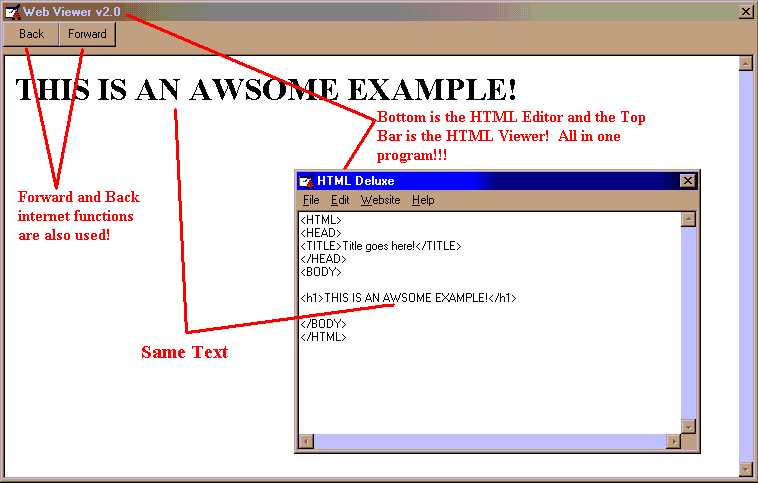

## An HTML Editor And Viewer\!

### Description

This program will show you how to make a text editor AND show you how to view a Webpage made in HTML in the same program.
 
### More Info
 
The user inputs some HTML.

The program then returns a webpage!

             |
---                |---
**Submitted On**   |2001-08-26 11:27:20
**By**             |[Alex M](https://github.com/Planet-Source-Code/PSCIndex/blob/master/ByAuthor/alex-m.md)
**Level**          |Intermediate
**User Rating**    |4.0 (8 globes from 2 users)
**Compatibility**  |VB 5\.0, VB 6\.0
**Category**       |[Internet/ HTML](https://github.com/Planet-Source-Code/PSCIndex/blob/master/ByCategory/internet-html__1-34.md)
**World**          |[Visual Basic](https://github.com/Planet-Source-Code/PSCIndex/blob/master/ByWorld/visual-basic.md)
**Archive File**   |[An HTML Ed253738262001\.zip](https://github.com/Planet-Source-Code/alex-m-an-html-editor-and-viewer__1-26670/archive/master.zip)

